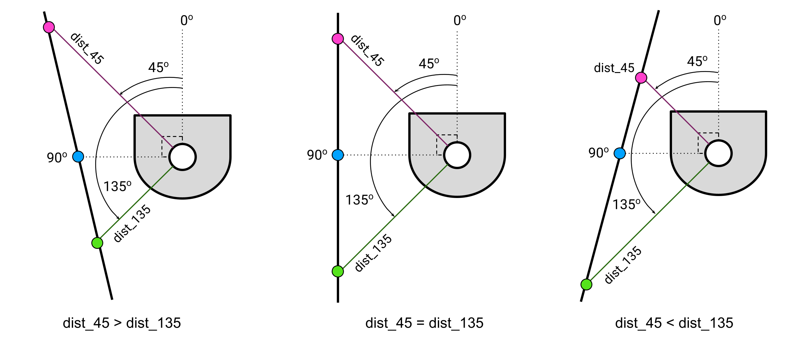

# Warmup Project
*Anusha Karandikar*
*Introduction to Computational Robotics, Fall 2023*

- [Introduction](#introduction)
- [Behaviors](#behaviors)
    * [Robot Teleop](#robot_teleop)
    * [Driving in a Square](#drive_square)
    * [Wall Follower](#wall_follower)
    * [Person Follower](#person_follower)
    * [Obstacle Avoider](#obstacle_avoider)
    * [Finite State Controller](#finite_state_controller)
- [Reflection](#reflection)

# Introduction
Over the course of this project, I implemented five primary behaviors on a Neato robot platform: teleoperation, driving in a square, wall following, person following, and obstacle avoidance. The final behavior was a finite state controller to switch between two behaviors (wall following and person following).

[Watch a live demo of some of the behaviors here.](https://youtu.be/4wJ-5gZ68Jo?si=zt4bmyDAzNCe15H-)

# Behaviors

## [Robot Teleop](/warmup_project/warmup_project/teleop.py)
The robot teleoperator controls the Neato’s movement depending on the user’s keyboard input. The W and X keys command the robot to drive forwards and backwards, respectively, at 1 meter per second. The S key brings it to a stop. I decided to have the A and D keys make the robot turn counterclockwise and clockwise, respectively, and then continue driving forward. For these turning commands, the robot turns at 1 radian per second for enough time to make a 90 degree turn, then drives straight per a linear velocity command. Once a key is pressed, the behavior continues until another key is pressed.

| Key    | Result |
| -------- | ------- |
| W | Drive forwards |
| A | Turn counterclockwise, then drive forwards |
| x | Drive backwards |
| D | Turn clockwise, then drive forwards |
| S | Stop |

The code consists of one main if statement that checks for the keyboard input. If I had more time, I would want to structure my velocity commands more efficiently by using functions.

## [Driving in a Square](/warmup_project/warmup_project/drive_square.py)
To make the robot drive in a square, I used a time-based approach to command the velocity messages. To calculate the time needed for the robot to drive the length of one side, I divided the desired length by the linear velocity I defined. Similarly, to find the time needed for the robot to turn a complete right angle, I divided the radians by the angular velocity. Once I had these time values, I used an if statement to check the time passed and call the functions defining the necessary velocities.

Something I found tricky about this behavior was that I had to correct for turning time. Using the precise radians for a right angle turn resulted in a smaller turn in practice, so I experimentally increased the radians until the behavior looked correct. If I had more time, I would have tried approaching the problem using the Neato's odometry.

## [Wall Follower](/warmup_project/warmup_project/wall_follower.py)

    
    Figure 1: Wall follower conditions

The wall follower script pilots the Neato to drive forward along a wall while aligning itself to be parallel to the wall. It is assumed that the Neato is close to a wall on its left side when the program starts. The Neato platform returns LIDAR readings, which I used to determine its parallelism and distance to the wall. The main readings I used were for the angles of 45, 90, and 135 degrees.

The Neato defaults to purely driving forwards, with angular velocity controlled by the distance readings: if the distance reading from 45 degrees is *greater* than the reading from 135 degrees (leftmost diagram in Figure 1), this indicates that the Neato is oriented away from the wall. Therefore, the angular velocity is set to a positive (i.e., counterclockwise) value to turn the Neato back towards the wall. In this case, the angular velocity is *directly* proportionally controlled by the distance reading at 90 degrees. If the Neato has traveled far from the wall, it is imperative to correct the behavior before the Neato gets too far and no longer receives readings from the wall. Therefore, if the distance at 90 degrees is bigger, the Neato will turn back towards the wall faster, and vice versa; if the Neato is still close to the wall and the distance at 90 degrees is small, the Neato can turn more slowly.

Similarly, if the distance reading from 45 degrees is *less* than the reading from 135 degrees (rightmost diagram in Figure 1), this indicates that the Neato is oriented towards the wall, and risks running into it. Therefore, the angular velocity is set to a negative (i.e., clockwise) value to turn the Neato away from the wall. In this case, the angular velocity is *inversely* proportionally controlled by the distance reading at 90 degrees. If the Neato is oriented towards the wall, the heading of the robot needs to be changed quickly before it can run into the wall. Therefore, if the distance at 90 degrees is small, the angular velocity will be greater; if the distance is bigger, there is more time to correct the heading, so the angular velocity can be smaller.

If the distance readings from 45 and 135 degrees are *equal* (middle diagram in Figure 1), the robot tries to get parallel to the wall at a distance of 0.3 meters. If the distance reading at 90 degrees is above 0.3 meters, the angular velocity is set to a positive value to turn the Neato counterclockwise and get closer to the wall. If the distance reading at 90 degrees is less than 0.3 meters, the angular velocity is set to a negative value to turn the Neato clockwise and get further away from the wall.

For the wall follower, I chose to visualize the LIDAR scan readings at 45, 90, and 135 degrees. To do so, I converted the readings into cartesian coordinates using the following equations (with angle $A$) so that I could plot them in the Neato’s base_link coordinate frame:

    $x = (\text{distance reading at } A&deg;) \times \cos(A&deg;)$  
    $y = (\text{distance reading at } A&deg;) \times \sin(A&deg;)$

The code in this script is primarily structured in a series of nested if loops. For this behavior, like a few others, I monitored the bump sensors on the Neato to make it stop if they were active (i.e., if the Neato hit something). One difficulty I encountered was that some of the Neatos did not return readings at select angles, so I had to remember to check my outputs with print statements whenever I connected to a Neato. If I had more time, I would have explored condensing my code by containing the velocity commands in separate functions. I would also have liked to try a different visualization method such as MarkerArray to make my visualization functions more efficient.

## [Person Follower](/warmup_project/warmup_project/person_follower.py)

      
    Figure 2: Person follower

The person follower script makes the Neato follow the center of mass of the LIDAR scan readings in front of it, which is assumed to represent a person.

The first important section of the script is the scan processing. From the 360-degree scan.ranges array returned by the LaserScan message, I saved entries with distance readings below 1.5 meters and angles between 0-90 degrees and 270-360 degrees (which covers the front semicircle of the Neato’s LIDAR scan). I converted each of these filtered values into cartesian coordinates using the following equations:

$x = \text{distance} \times \cos(\text{angle})$  
$y = \text{distance} \times \sin(\text{angle})$

I took the average of all the x- and y-values to get the x- and y-coordinates of the center of mass, which I then used to determine the velocity commands.

The Neato drives forward at a linear velocity directly proportional to the x-coordinate of the center of mass. This makes the robot move faster if the target is further away and slower if the target is closer. The angular velocity of the Neato is positively and directly proportional to the y-coordinate of the center of mass. If the y is negative, indicating that the target is to the right of the Neato, the angular velocity will also be negative, making the Neato turn clockwise towards the target. If the y is positive, indicating that the target is to the left of the Neato, the angular velocity will be positive, making the Neato turn counterclockwise towards the target.

Due to the proportional control, if the target is further to the sides of the Neato and the y-coordinate is large, the angular velocity will be greater so that the Neato turns towards the target faster. If the target is closer to the x-axis and the y-coordinate is smaller, the angular velocity will be smaller since the Neato will have to turn less to face the target.

For this behavior, I chose to visualize the center of mass of the readings, which represented the person. Since the center of mass is typically very close to the Neato, I multiplied the values of the x- and y-coordinates by a scalar in order to magnify the value and make the center of mass easier to see in RViz.

The velocity commands in this script are contained in one if statement that monitors the bump sensors to make the Neato stop if they are active (i.e., if the Neato hit something). A tricky part of this implementation was experimentally fine-tuning which scan readings I wanted to save. I had to balance between allowing a large enough distance and angle range to get readings without getting too close to the Neato, and restricting the distances and angles to block out noise from the surroundings. If I had more time, I would have separated the scan processing into its own function for readability and efficiency. I would also have liked to implement a more sophisticated PID controller for the velocities.

## [Obstacle Avoider](/warmup_project/warmup_project/obstacle_avoider.py)

      
    Figure 3: Obstacle avoider

The obstacle avoider script makes the Neato drive straight while avoiding obstacles in its path. I approached this behavior in a very similar way to the person follower.

I processed the Neato’s LIDAR scans in a separate function. From the 360-degree scan.ranges array returned by the LaserScan message, I saved entries with distance readings below 1.0 meters and angles between 0-45 degrees and 315-360 degrees (which covers the front quarter-circle of the Neato’s LIDAR scan). I converted each of these filtered values into cartesian coordinates using the following equations:

$x = \text{distance} \times \cos(\text{angle})$  
$y = \text{distance} \times \sin(\text{angle})$

Once again, I used the cartesian coordinates to get the x- and y-coordinates of the center of mass of the scan readings, which represents the main obstacle in the Neato’s path. I added another variable, obstacle_angle, to keep track of the angle of the center of mass within the Neato’s base_link coordinate frame. To calculate this angle, I converted the center of mass back to polar coordinates:

$obstacle_angle = \atan(y_COM/x_COM)$

Due to the nature of inverse tan, this equation returns the angle within the range -45 to 45 degrees.

For the velocity commands, if both coordinates of the center of mass are 0 (indicating no obstacles present), the Neato defaults to driving forward. If there *is* an obstacle, the angular velocity is negatively proportional to the obstacle angle. This means that if the obstacle angle is in the range 0 to 45 degrees (i.e., to the left of the Neato), the angular velocity will be negative, turning the Neato clockwise away from the obstacle. If the obstacle angle is in the range -45 to 0 degrees (i.e., to the right of the Neato), the angular velocity will be positive, turning the Neato counterclockwise away from the obstacle. The angular velocity is also inversely proportional to the obstacle angle; if the magnitude of the angle is closer to 45 and the obstacle is closer to the sides of the Neato, the angular velocity will be smaller and Neato can turn more slowly away since the risk of running into it is low. If the magnitude of the angle is closer to 0 and the obstacle is closer to the center of the Neato, the angular velocity will be great and the Neato will turn more sharply away to avoid the obstacle.

For this behavior, I made a slightly more complex visualization; if the center of mass of the obstacle is 0, meaning that there are no obstacles in range, I created a teal marker at coordinates (0.5 m, 0.0 m) in the Neato’s base_link coordinate frame to indicate that the Neato is simply driving forward. If there is an obstacle in range, a pink marker is created at the obstacle’s center of mass. Like the visualization for the person follower, I magnified these coordinates to make them easier to see in RViz.

For this script, I separated the scan processing and velocity commands into separate functions, which I believe made the script much easier to read. If I had more time, I would have tried to implement the most-sophisticated potential fields approach.

## [Finite State Controller](/warmup_project/warmup_project/finite_state_controller.py)

# Reflection
I chose to work alone so that I could work on every aspect of this project and build an intuition for robot programming. While I do think I gained what I wanted from the experience, completing the entire project by myself - especially with a lack of experience - took much longer than the project was supposed to.

The biggest hurdle I had to overcome to complete this project was my lack of experience with python and ROS. Upon reflection, I think I am much more comfortable with the basics of programming now, though there are a lot of advanced techniques I would like to learn to make my code better. I am aware that a lot of my code can be much more efficiently programmed than it is - unfortunately, I ran out of time to do so.